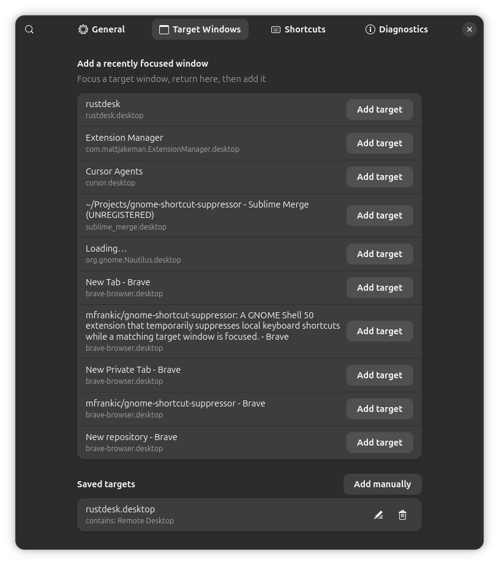
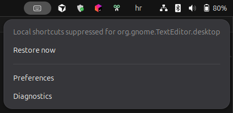

# GNOME Shortcut Suppressor

[](https://github.com/mfrankic/gnome-shortcut-suppressor/actions/workflows/build.yml)

A GNOME Shell 50 extension that temporarily suppresses **local** keyboard shortcuts while a
**matching target window** is focused—useful for remote desktop, VMs, and nested sessions
where `Super`, workspaces, and media keys should stay on the guest OS.


## Screenshots

| Preferences → Target Windows                                     | Panel status                                               |
| ---------------------------------------------------------------- | ---------------------------------------------------------- |
|  |  |

## Features

- Standard mode suppresses GNOME, Mutter, media, custom, and overlay shortcuts.
- Extended mode can also suppress individually selected extension shortcuts,
  and, when enabled, active runtime accelerator grabs.
- A recovery journal restores exact user overrides after focus changes, errors,
  Shell restarts, or extension disablement.
- A configurable restore shortcut (`Ctrl+Alt+Escape` by default), shortcuts
  kept on this computer, panel status, and redacted diagnostics are included.

## Requirements

- GNOME Shell 50
- A Wayland or X11 GNOME session

## Install from source

Build and install the extension archive:

```sh
gnome-extensions pack --force --extra-source=core.js --extra-source=icon.svg
gnome-extensions install --force ./gnome-shortcut-suppressor@mfrankic.shell-extension.zip
```

Log out and back in after the first installation, then enable it:

```sh
gnome-extensions enable gnome-shortcut-suppressor@mfrankic
```

Open its settings with:

```sh
gnome-extensions prefs gnome-shortcut-suppressor@mfrankic
```

## Quick start

1. Open **Target Windows** in Preferences.
2. Focus the remote or other target window, return to Preferences, and select
   **Add target** beside it. Use **Add manually** only when it cannot be
   observed.
3. In **General**, leave **Automatic suppression** enabled and choose when
   shortcuts should be suppressed.
4. Focus the target and verify that the panel menu says **Local shortcuts
   suppressed**. Press `Ctrl+Alt+Escape` at any time to restore local shortcuts.

## Development

Run the checks used by the Build workflow:

```sh
gjs -m tests/core.test.js
glib-compile-schemas --strict --dry-run schemas
node --check core.js && node --check extension.js && node --check prefs.js
gnome-extensions pack --force --extra-source=core.js --extra-source=icon.svg
```

Generated schema and extension archives are ignored by Git.

## Safety and privacy

Shortcut settings are journaled before suppression and restored only when their
current value still matches the value written by this extension. External
changes are therefore not overwritten. Custom-shortcut commands are never read
or copied, and diagnostic exports omit window titles unless explicitly enabled.

Runtime accelerator grabs stay in place unless Extended mode and the
Active app and extension grabs option are both enabled. That option suppresses
every active external grab, including grabs from applications and other
extensions, because GNOME does not expose an owner. Grabs registered after
suppression begins stay on this computer until the next suppression. If GNOME
Shell’s private runtime registry is unavailable, suppression continues and a
diagnostic warning is recorded. Runtime grab state is kept in memory only, so a
Shell restart recreates those grabs normally.

## Publishing

Source, issues, and development live on [GitHub](https://github.com/mfrankic/gnome-shortcut-suppressor).
Installable releases are packed with `gnome-extensions pack` and submitted to
[extensions.gnome.org](https://extensions.gnome.org/) for review and distribution.

## Support

If this extension saves you time, you can [buy me a coffee on Ko-fi](https://ko-fi.com/mfrankic).
GitHub also shows the same link under **Sponsor** via [FUNDING.yml](.github/FUNDING.yml).

## License

[MIT](LICENSE)
